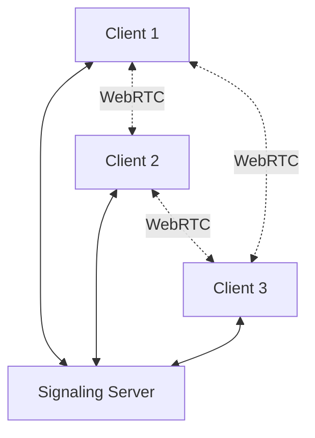
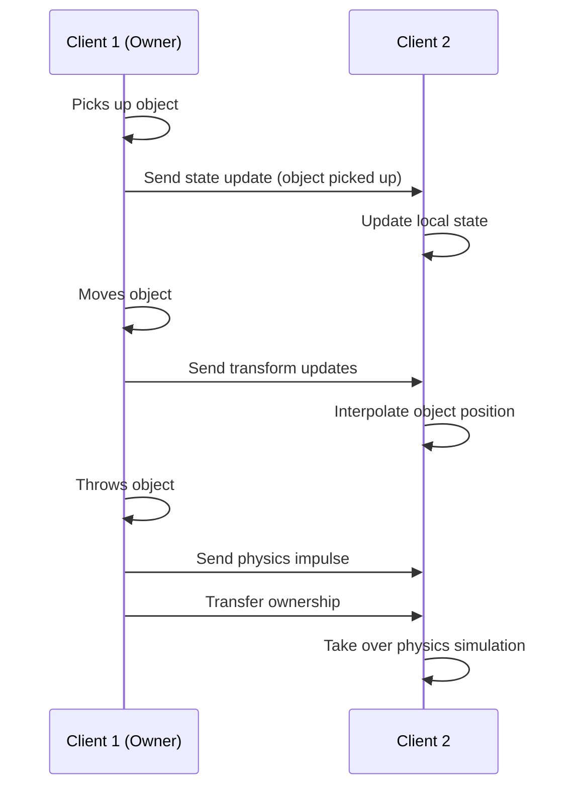

# Multiplayer Preparation

This document outlines the preparations made in the codebase to support future multiplayer functionality with positional audio.

## Current Optimizations for Multiplayer

The recent code reorganization and optimization has laid the groundwork for multiplayer functionality:

1. **Modular Code Structure**
   - Clear separation of concerns
   - Well-defined component boundaries
   - Centralized state management
   - Components organized in js/components/, managers in js/managers/, and utilities in js/utils/

2. **State Machine Implementation**
   - Predictable state transitions
   - Easier state synchronization between clients
   - Clear event-based architecture
   - Implemented in js/utils/StateMachine.js

3. **Improved Memory Management**
   - Proper cleanup of resources
   - Reusable objects to reduce garbage collection
   - Better performance for multiple connected clients
   - Consistent event listener cleanup in component remove() methods

4. **Standardized Event System**
   - Consistent event naming and handling
   - Easier to hook into for network synchronization
   - Clear event propagation paths
   - Custom events for multiplayer state changes

5. **MultiplayerManager Implementation**
   - Basic structure implemented in js/main.js
   - Will be moved to js/managers/MultiplayerManager.js
   - Includes connection management, peer tracking, and UI

## Multiplayer Architecture Plan

### 1. Network Layer

The multiplayer implementation will use a client-server architecture with WebRTC for peer-to-peer connections:



### 2. State Synchronization

The application will use a hybrid approach for state synchronization:

- **Authority-based model** for critical game state
- **Ownership transfer** for interactive objects
- **Interpolation and prediction** for smooth movement



### 3. Positional Audio

Positional audio will be implemented using the Web Audio API with spatial audio nodes:

```javascript
// Example implementation
function createPositionalAudio(audioUrl, position) {
  // Create audio context
  const audioContext = new (window.AudioContext || window.webkitAudioContext)();

  // Create spatial audio panner
  const panner = audioContext.createPanner();
  panner.panningModel = 'HRTF'; // Head-related transfer function for realistic 3D audio
  panner.distanceModel = 'inverse';
  panner.refDistance = 1;
  panner.maxDistance = 10000;
  panner.rolloffFactor = 1;
  panner.coneInnerAngle = 360;
  panner.coneOuterAngle = 0;
  panner.coneOuterGain = 0;

  // Set position
  panner.setPosition(position.x, position.y, position.z);

  // Connect to audio graph
  const source = audioContext.createBufferSource();
  source.connect(panner);
  panner.connect(audioContext.destination);

  // Load audio
  fetch(audioUrl)
    .then(response => response.arrayBuffer())
    .then(buffer => audioContext.decodeAudioData(buffer))
    .then(decodedData => {
      source.buffer = decodedData;
      source.start(0);
    });

  return {
    panner,
    source,
    updatePosition(newPosition) {
      panner.setPosition(newPosition.x, newPosition.y, newPosition.z);
    }
  };
}
```

### 4. Player Representation

Players will be represented with:

- Avatar models with inverse kinematics
- Synchronized head and hand movements
- Voice chat through positional audio
- Networked physics interactions

## Implementation Roadmap

1. **Phase 1: Networking Foundation**
   - Implement WebRTC connection handling
   - Set up signaling server
   - Basic presence synchronization (player join/leave)

2. **Phase 2: State Synchronization**
   - Player position/rotation synchronization
   - Object ownership and interaction synchronization
   - Physics state synchronization

3. **Phase 3: Voice Communication**
   - Implement WebRTC audio streams
   - Add positional audio processing
   - Voice activity detection and indicators

4. **Phase 4: Advanced Features**
   - Full avatar representation with IK
   - Shared interactive elements
   - Persistent world state

## Technical Considerations

### WebRTC Implementation

The application will use a library like PeerJS or simple-peer to simplify WebRTC implementation:

```javascript
// Example using simple-peer
import Peer from 'simple-peer';

function createPeer(initiator, signalCallback, streamCallback) {
  const peer = new Peer({ initiator });

  peer.on('signal', data => {
    // Send signal data to the other peer via signaling server
    signalCallback(data);
  });

  peer.on('stream', stream => {
    // Received a stream from the other peer
    streamCallback(stream);
  });

  // Method to connect to another peer
  function connect(signalData) {
    peer.signal(signalData);
  }

  return {
    peer,
    connect
  };
}
```

### Optimizing Network Traffic

To minimize network traffic and ensure good performance:

1. **Delta compression** - Only send changes in state
2. **Message prioritization** - Critical updates get priority
3. **Update frequency adaptation** - Adjust based on network conditions
4. **Interest management** - Only sync relevant objects based on proximity

### Scalability Considerations

For larger multiplayer scenarios:

1. **Spatial partitioning** - Divide the world into zones
2. **Peer groups** - Connect only to nearby players
3. **Server authority** - Use server validation for critical actions
4. **Load balancing** - Distribute computation across clients

## Conclusion

The recent code optimizations have established a solid foundation for implementing multiplayer functionality. The modular architecture, state management improvements, and performance optimizations will make it easier to add networking capabilities while maintaining good performance across all devices.

The next steps will involve implementing the WebRTC connection layer, setting up state synchronization, and adding positional audio support.
