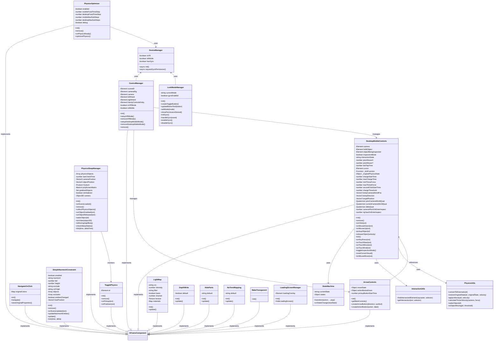

# Class Diagram for Main Components

```mermaid
classDiagram
    %% Main Classes/Components
    class DeviceManager {
        -boolean isVR
        -boolean isMobile
        -boolean hasGyro
        +async init()
        +async requestGyroPermission()
    }

    class LookModeManager {
        -string currentMode
        -boolean gyroEnabled
        +init()
        +createToggleButton()
        +updateButtonText(button)
        +setMode(mode)
        +showPermissionDenied()
        +initGyro()
        +handleGyro(event)
        +enableGyro()
        +disableGyro()
    }

    class ControlManager {
        -Element sceneEl
        -Element cameraRig
        -Element camera
        -Element leftHand
        -Element rightHand
        -Element handyControlsEntity
        -boolean isVRMode
        -boolean isMobile
        +init()
        +setupVRMode()
        +removeVRMode()
        +setupDesktopMobileMode()
        +removeDesktopMobileMode()
        +remove()
    }

    class DesktopMobileControls {
        -Element camera
        -Element heldObject
        -Element objectBeingInspected
        -boolean inspectionMode
        -string interactionState
        -number prevMouseX
        -number prevMouseY
        -number lastTapTime
        -Element cursor
        -Function _tickFunction
        -Object _originalPhysicsState
        -number chargeStartTime
        -number maxChargeTime
        -number minThrowForce
        -number maxThrowForce
        -number secondClickStartTime
        -number chargeThreshold
        -Vector3 tempCameraWorldPos
        -Vector3 tempDirection
        -Vector3 targetPosition
        -Quaternion prevCameraWorldQuat
        -Quaternion currentCameraWorldQuat
        -Quaternion deltaQuat
        -number cameraPitchOnEnterInspect
        -number rigYawOnEnterInspect
        +init()
        +remove()
        +onClick(evt)
        +onMouseDown(evt)
        +onMouseUp(evt)
        +pickupObject(el)
        +releaseObject(velocity)
        +tick()
        +onKeyPress(evt)
        +onTouchStart(evt)
        +onTouchMove(evt)
        +onTouchEnd(evt)
        +toggleInspectionMode()
        +resetCursorVisual()
        +onMouseMove(evt)
    }

    class ArrowControls {
        -Object moveState
        -Object actionButtonDown
        -number pickupButtonStartTime
        +init()
        +getMainControls()
        +createArrowButton(direction, symbol)
        +createActionButton(action, label)
    }

    class NavigateOnClick {
        -Map originalColors
        +init()
        +navigate()
        +storeOriginalProperties()
    }

    class SimpleNavmeshConstraint {
        -boolean enabled
        -string navmesh
        -number fall
        -number height
        -string exclude
        -string xzOrigin
        -Array objects
        -Array excludes
        -boolean entitiesChanged
        -Vector3 lastPosition
        +init()
        +remove()
        +onSceneUpdated(evt)
        +updateNavmeshEntities()
        +update()
        +tick(time, delta)
    }

    class TogglePhysics {
        -Element el
        +init()
        +remove()
        +onPickup(evt)
        +onPutdown(evt)
    }

    class PhysicsSleepManager {
        -Array physicsObjects
        -number lastCheckTime
        -Vector3 cameraPosition
        -Vector3 objectPosition
        -Frustum frustum
        -Matrix4 projScreenMatrix
        -Set grabbedObjects
        -boolean isInitialized
        -Object3D camera
        +init()
        +onSceneLoaded()
        +remove()
        +collectPhysicsObjects()
        +onObjectGrabbed(evt)
        +onObjectReleased(evt)
        +wakeObject(el)
        +isInView(object3D)
        +isMoving(rigidBody)
        +checkSleepStates()
        +tick(time, deltaTime)
    }

    class PhysicsOptimizer {
        -boolean enabled
        -number mobileFixedTimeStep
        -number desktopFixedTimeStep
        -number mobileMaxSubSteps
        -number desktopMaxSubSteps
        -boolean debug
        +init()
        +remove()
        +onPhysicsReady()
        +optimizePhysics()
    }

    class PhysicsUtils {
        +convertToKinematic(el)
        +restoreOriginalState(el, originalState, velocity)
        +applyVelocity(el, velocity)
        +calculateThrowVelocity(camera, force)
        +wakeObject(el)
        +isObjectMoving(el, threshold)
    }

    class StateMachine {
        -string currentState
        -Object states
        +transition(action, ...args)
        +onStateChange(newState)
    }

    class InteractionUtils {
        +findIntersectedElement(raycaster, selector)
        +getIntersection(evt, selector)
    }

    %% Utility Components
    class LightMap {
        -string src
        -number intensity
        -string filter
        -boolean basis
        -number channel
        -Texture texture
        -Map materials
        +init()
        +update()
    }

    class DepthWrite {
        -boolean default
        +init()
        +update()
    }

    class HideParts {
        -string default
        +init()
        +update()
    }

    class NoToneMapping {
        -string default
        +init()
        +update()
    }

    class MakeTransparent {
        +init()
    }

    class LoadingScreenManager {
        -Element loadingOverlay
        +init()
        +hideLoadingScreen()
    }

    %% Relationships
    DeviceManager <-- LookModeManager : uses
    DeviceManager <-- ControlManager : uses
    ControlManager --> DesktopMobileControls : manages
    ControlManager --> ArrowControls : manages
    DesktopMobileControls <-- ArrowControls : references
    DesktopMobileControls --> PhysicsUtils : uses
    DesktopMobileControls --> InteractionUtils : uses
    DesktopMobileControls --> StateMachine : uses
    PhysicsSleepManager --> TogglePhysics : monitors
    PhysicsOptimizer --> DeviceManager : uses

    %% Inheritance/Implementation
    SimpleNavmeshConstraint --|> AFrameComponent : implements
    LightMap --|> AFrameComponent : implements
    DepthWrite --|> AFrameComponent : implements
    HideParts --|> AFrameComponent : implements
    NoToneMapping --|> AFrameComponent : implements
    MakeTransparent --|> AFrameComponent : implements
    NavigateOnClick --|> AFrameComponent : implements
    TogglePhysics --|> AFrameComponent : implements
    ControlManager --|> AFrameComponent : implements
    DesktopMobileControls --|> AFrameComponent : implements
    ArrowControls --|> AFrameComponent : implements
    PhysicsSleepManager --|> AFrameComponent : implements
    PhysicsOptimizer --|> AFrameComponent : implements
    LoadingScreenManager --|> AFrameComponent : implements
```
