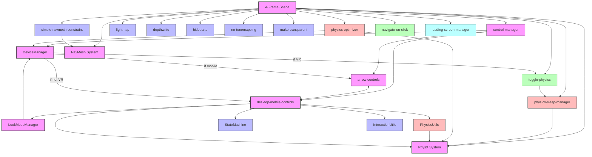

# Component Relationship Diagram

```mermaid
graph TD
    %% Main Components
    Scene[A-Frame Scene]
    DeviceManager[DeviceManager]
    ControlManager[control-manager]
    DesktopMobileControls[desktop-mobile-controls]
    LookModeManager[LookModeManager]
    ArrowControls[arrow-controls]
    PhysX[PhysX System]
    NavMesh[NavMesh System]

    %% Physics Optimization Components
    PhysicsSleepManager[physics-sleep-manager]
    PhysicsOptimizer[physics-optimizer]
    PhysicsUtils[PhysicsUtils]

    %% Model Utility Components
    LightMap[lightmap]
    DepthWrite[depthwrite]
    HideParts[hideparts]
    NoToneMapping[no-tonemapping]
    MakeTransparent[make-transparent]
    NavMeshConstraint[simple-navmesh-constraint]

    %% Interaction Components
    NavigateOnClick[navigate-on-click]
    TogglePhysics[toggle-physics]

    %% UI Components
    LoadingScreenManager[loading-screen-manager]

    %% Utility Components
    StateMachine[StateMachine]
    InteractionUtils[InteractionUtils]

    %% Relationships
    Scene --> ControlManager
    Scene --> PhysX
    Scene --> NavMesh
    Scene --> PhysicsSleepManager
    Scene --> PhysicsOptimizer
    Scene --> LoadingScreenManager

    ControlManager --> DeviceManager
    ControlManager --> DesktopMobileControls
    ControlManager --> ArrowControls

    DesktopMobileControls --> LookModeManager
    DesktopMobileControls --> PhysicsUtils
    DesktopMobileControls --> InteractionUtils
    DesktopMobileControls --> StateMachine

    %% Physics Relationships
    PhysicsSleepManager --> PhysX
    PhysicsOptimizer --> PhysX
    PhysicsUtils --> PhysX
    TogglePhysics --> PhysicsSleepManager

    %% Model Utility Relationships
    Scene --> LightMap
    Scene --> DepthWrite
    Scene --> HideParts
    Scene --> NoToneMapping
    Scene --> MakeTransparent
    Scene --> NavMeshConstraint

    %% Interaction Relationships
    Scene --> NavigateOnClick
    Scene --> TogglePhysics

    %% Component Dependencies
    DesktopMobileControls --> PhysX
    NavMeshConstraint --> NavMesh
    ArrowControls <--> DesktopMobileControls
    LookModeManager --> DeviceManager
    PhysicsOptimizer --> DeviceManager

    %% Conditional Relationships
    DeviceManager -- "if mobile" --> ArrowControls
    DeviceManager -- "if VR" --> TogglePhysics
    DeviceManager -- "if not VR" --> DesktopMobileControls

    %% Style
    classDef core fill:#f9f,stroke:#333,stroke-width:2px
    classDef physics fill:#fbb,stroke:#333,stroke-width:1px
    classDef utility fill:#bbf,stroke:#333,stroke-width:1px
    classDef interaction fill:#bfb,stroke:#333,stroke-width:1px
    classDef ui fill:#bff,stroke:#333,stroke-width:1px

    class Scene,DeviceManager,ControlManager,DesktopMobileControls,LookModeManager,ArrowControls,PhysX,NavMesh core
    class PhysicsSleepManager,PhysicsOptimizer,PhysicsUtils physics
    class LightMap,DepthWrite,HideParts,NoToneMapping,MakeTransparent,NavMeshConstraint,StateMachine,InteractionUtils utility
    class NavigateOnClick,TogglePhysics interaction
    class LoadingScreenManager ui
```
