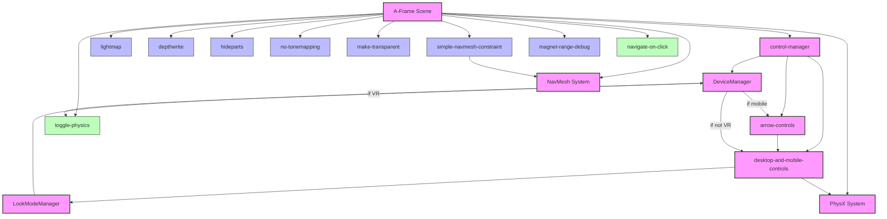

# Component Relationship Diagram

```mermaid
graph TD
    %% Main Components
    Scene[A-Frame Scene]
    DeviceManager[DeviceManager]
    ControlManager[control-manager]
    DesktopMobileControls[desktop-and-mobile-controls]
    LookModeManager[LookModeManager]
    ArrowControls[arrow-controls]
    PhysX[PhysX System]
    NavMesh[NavMesh System]
    
    %% Model Utility Components
    LightMap[lightmap]
    DepthWrite[depthwrite]
    HideParts[hideparts]
    NoToneMapping[no-tonemapping]
    MakeTransparent[make-transparent]
    NavMeshConstraint[simple-navmesh-constraint]
    MagnetRangeDebug[magnet-range-debug]
    
    %% Interaction Components
    NavigateOnClick[navigate-on-click]
    TogglePhysics[toggle-physics]
    
    %% Relationships
    Scene --> ControlManager
    Scene --> PhysX
    Scene --> NavMesh
    
    ControlManager --> DeviceManager
    ControlManager --> DesktopMobileControls
    ControlManager --> ArrowControls
    
    DesktopMobileControls --> LookModeManager
    
    %% Model Utility Relationships
    Scene --> LightMap
    Scene --> DepthWrite
    Scene --> HideParts
    Scene --> NoToneMapping
    Scene --> MakeTransparent
    Scene --> NavMeshConstraint
    Scene --> MagnetRangeDebug
    
    %% Interaction Relationships
    Scene --> NavigateOnClick
    Scene --> TogglePhysics
    
    %% Component Dependencies
    DesktopMobileControls --> PhysX
    NavMeshConstraint --> NavMesh
    ArrowControls --> DesktopMobileControls
    LookModeManager --> DeviceManager
    
    %% Conditional Relationships
    DeviceManager -- "if mobile" --> ArrowControls
    DeviceManager -- "if VR" --> TogglePhysics
    DeviceManager -- "if not VR" --> DesktopMobileControls
    
    %% Style
    classDef core fill:#f9f,stroke:#333,stroke-width:2px
    classDef utility fill:#bbf,stroke:#333,stroke-width:1px
    classDef interaction fill:#bfb,stroke:#333,stroke-width:1px
    
    class Scene,DeviceManager,ControlManager,DesktopMobileControls,LookModeManager,ArrowControls,PhysX,NavMesh core
    class LightMap,DepthWrite,HideParts,NoToneMapping,MakeTransparent,NavMeshConstraint,MagnetRangeDebug utility
    class NavigateOnClick,TogglePhysics interaction
```
