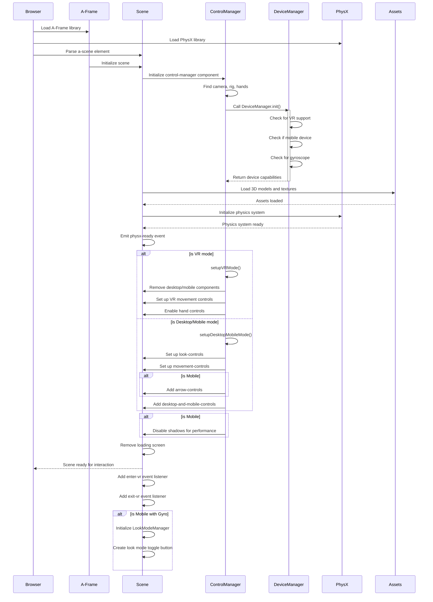

# Initialization Sequence Diagram

```mermaid
sequenceDiagram
    participant Browser
    participant AFrame as A-Frame
    participant Scene
    participant CM as ControlManager
    participant DM as DeviceManager
    participant PhysX
    participant Assets
    
    %% Initial Loading
    Browser->>AFrame: Load A-Frame library
    Browser->>PhysX: Load PhysX library
    Browser->>Scene: Parse a-scene element
    
    %% A-Frame Initialization
    AFrame->>Scene: Initialize scene
    Scene->>CM: Initialize control-manager component
    
    %% Control Manager Setup
    CM->>CM: Find camera, rig, hands
    CM->>DM: Call DeviceManager.init()
    
    %% Device Detection
    activate DM
    DM->>DM: Check for VR support
    DM->>DM: Check if mobile device
    DM->>DM: Check for gyroscope
    DM-->>CM: Return device capabilities
    deactivate DM
    
    %% Asset Loading
    Scene->>Assets: Load 3D models and textures
    Assets-->>Scene: Assets loaded
    
    %% PhysX Initialization
    Scene->>PhysX: Initialize physics system
    PhysX-->>Scene: Physics system ready
    Scene->>Scene: Emit physx-ready event
    
    %% Control Setup Based on Device
    alt is VR mode
        CM->>CM: setupVRMode()
        CM->>Scene: Remove desktop/mobile components
        CM->>Scene: Set up VR movement controls
        CM->>Scene: Enable hand controls
    else is Desktop/Mobile mode
        CM->>CM: setupDesktopMobileMode()
        CM->>Scene: Set up look-controls
        CM->>Scene: Set up movement-controls
        
        alt is Mobile
            CM->>Scene: Add arrow-controls
        end
        
        CM->>Scene: Add desktop-and-mobile-controls
    end
    
    %% Mobile-Specific Setup
    alt is Mobile
        CM->>Scene: Disable shadows for performance
    end
    
    %% Final Initialization
    Scene->>Scene: Remove loading screen
    Scene-->>Browser: Scene ready for interaction
    
    %% Event Listeners Setup
    Scene->>Scene: Add enter-vr event listener
    Scene->>Scene: Add exit-vr event listener
    
    %% Look Mode Setup (if mobile with gyro)
    alt is Mobile with Gyro
        Scene->>Scene: Initialize LookModeManager
        Scene->>Scene: Create look mode toggle button
    end
```
