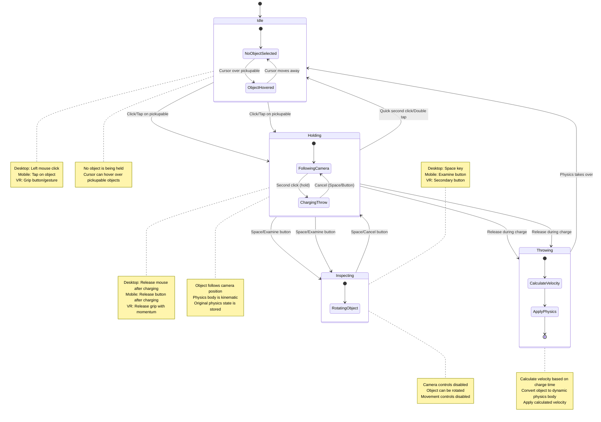

# State Diagram for Object Interactions

```mermaid
stateDiagram-v2
    [*] --> Idle
    
    %% Main States
    state Idle {
        [*] --> NoObjectSelected
        NoObjectSelected --> ObjectHovered : Cursor over pickupable
        ObjectHovered --> NoObjectSelected : Cursor moves away
    }
    
    state Holding {
        [*] --> FollowingCamera
        FollowingCamera --> ChargingThrow : Second click (hold)
        ChargingThrow --> FollowingCamera : Cancel (Space/Button)
    }
    
    state Inspecting {
        [*] --> RotatingObject
    }
    
    %% State Transitions
    Idle --> Holding : Click/Tap on pickupable
    Holding --> Idle : Quick second click/Double tap
    Holding --> Throwing : Release during charge
    Throwing --> Idle : Physics takes over
    Holding --> Inspecting : Space/Examine button
    Inspecting --> Holding : Space/Cancel button
    
    %% Nested States
    state Throwing {
        [*] --> CalculateVelocity
        CalculateVelocity --> ApplyPhysics
        ApplyPhysics --> [*]
    }
    
    %% Transition Details
    Idle --> Holding : Click/Tap on pickupable
    note right of Idle
        Desktop: Left mouse click
        Mobile: Tap on object
        VR: Grip button/gesture
    end note
    
    Holding --> Throwing : Release during charge
    note right of Holding
        Desktop: Release mouse after charging
        Mobile: Release button after charging
        VR: Release grip with momentum
    end note
    
    Holding --> Inspecting : Space/Examine button
    note left of Inspecting
        Desktop: Space key
        Mobile: Examine button
        VR: Secondary button
    end note
    
    %% State Descriptions
    note right of Idle
        No object is being held
        Cursor can hover over pickupable objects
    end note
    
    note right of Holding
        Object follows camera position
        Physics body is kinematic
        Original physics state is stored
    end note
    
    note right of Inspecting
        Camera controls disabled
        Object can be rotated
        Movement controls disabled
    end note
    
    note right of Throwing
        Calculate velocity based on charge time
        Convert object to dynamic physics body
        Apply calculated velocity
    end note
```
