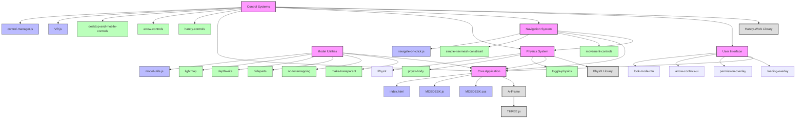

# Package Diagram

```mermaid
flowchart TD
    %% Main Packages
    Core[Core Application]
    Controls[Control Systems]
    Physics[Physics System]
    Models[Model Utilities]
    Navigation[Navigation System]
    UI[User Interface]
    
    %% Core Package
    Core --> index.html
    Core --> MOBDESK.js
    Core --> MOBDESK.css
    
    %% Control Systems Package
    Controls --> control-manager.js
    Controls --> VR.js
    Controls --> desktop-and-mobile-controls
    Controls --> arrow-controls
    Controls --> handy-controls
    
    %% Physics System Package
    Physics --> PhysX
    Physics --> physx-body
    Physics --> toggle-physics
    
    %% Model Utilities Package
    Models --> model-utils.js
    Models --> lightmap
    Models --> depthwrite
    Models --> hideparts
    Models --> no-tonemapping
    Models --> make-transparent
    
    %% Navigation System Package
    Navigation --> navigate-on-click.js
    Navigation --> simple-navmesh-constraint
    Navigation --> movement-controls
    
    %% User Interface Package
    UI --> look-mode-btn
    UI --> arrow-controls-ui
    UI --> permission-overlay
    UI --> loading-overlay
    
    %% Dependencies
    Controls --> Core
    Physics --> Core
    Models --> Core
    Navigation --> Core
    UI --> Core
    
    Navigation --> Physics
    Controls --> Physics
    Controls --> Navigation
    Controls --> UI
    
    %% External Dependencies
    AFrame[A-Frame]
    ThreeJS[THREE.js]
    PhysXLib[PhysX Library]
    HandyWork[Handy-Work Library]
    
    Core --> AFrame
    AFrame --> ThreeJS
    Physics --> PhysXLib
    Controls --> HandyWork
    
    %% Styling
    classDef package fill:#f9f,stroke:#333,stroke-width:2px
    classDef module fill:#bbf,stroke:#333,stroke-width:1px
    classDef component fill:#bfb,stroke:#333,stroke-width:1px
    classDef external fill:#ddd,stroke:#333,stroke-width:2px
    
    class Core,Controls,Physics,Models,Navigation,UI package
    class index.html,MOBDESK.js,MOBDESK.css,control-manager.js,VR.js,model-utils.js,navigate-on-click.js module
    class desktop-and-mobile-controls,arrow-controls,handy-controls,physx-body,toggle-physics,lightmap,depthwrite,hideparts,no-tonemapping,make-transparent,simple-navmesh-constraint,movement-controls component
    class AFrame,ThreeJS,PhysXLib,HandyWork external
```
