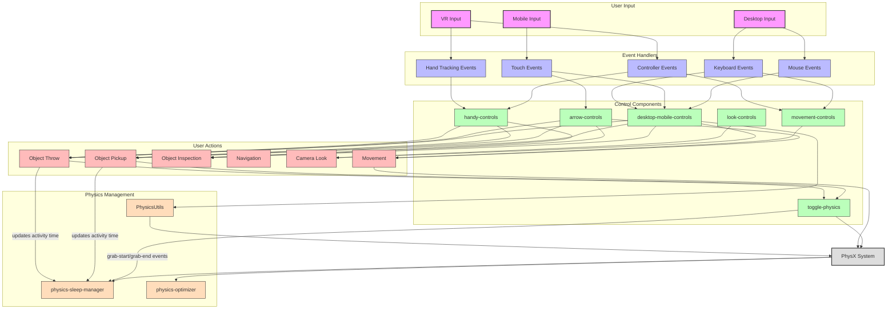

# Interaction Flow Diagram

```mermaid
flowchart TD
    %% User Input Sources
    DesktopInput[Desktop Input]
    MobileInput[Mobile Input]
    VRInput[VR Input]

    %% Input Handlers
    MouseEvents[Mouse Events]
    TouchEvents[Touch Events]
    KeyboardEvents[Keyboard Events]
    ControllerEvents[Controller Events]
    HandTrackingEvents[Hand Tracking Events]

    %% Components
    DesktopMobileControls[desktop-mobile-controls]
    ArrowControls[arrow-controls]
    HandyControls[handy-controls]
    LookControls[look-controls]
    MovementControls[movement-controls]
    TogglePhysics[toggle-physics]

    %% Physics Components
    PhysicsSleepManager[physics-sleep-manager]
    PhysicsOptimizer[physics-optimizer]
    PhysicsUtils[PhysicsUtils]

    %% Actions
    ObjectPickup[Object Pickup]
    ObjectThrow[Object Throw]
    ObjectInspect[Object Inspection]
    Navigation[Navigation]
    CameraLook[Camera Look]
    Movement[Movement]

    %% Physics
    PhysicsSystem[PhysX System]

    %% Input Flow
    DesktopInput --> MouseEvents
    DesktopInput --> KeyboardEvents
    MobileInput --> TouchEvents
    VRInput --> ControllerEvents
    VRInput --> HandTrackingEvents

    %% Event Handling
    MouseEvents --> DesktopMobileControls
    TouchEvents --> DesktopMobileControls
    TouchEvents --> ArrowControls
    KeyboardEvents --> DesktopMobileControls
    KeyboardEvents --> MovementControls
    ControllerEvents --> HandyControls
    ControllerEvents --> MovementControls
    HandTrackingEvents --> HandyControls

    %% Component Actions
    DesktopMobileControls --> ObjectPickup
    DesktopMobileControls --> ObjectThrow
    DesktopMobileControls --> ObjectInspect
    DesktopMobileControls --> CameraLook

    ArrowControls --> Movement
    ArrowControls --> ObjectPickup
    ArrowControls --> ObjectThrow
    ArrowControls --> ObjectInspect

    HandyControls --> ObjectPickup
    HandyControls --> ObjectThrow
    HandyControls --> ObjectInspect

    LookControls --> CameraLook
    MovementControls --> Movement

    %% Physics Interaction
    ObjectPickup --> TogglePhysics
    ObjectThrow --> TogglePhysics
    TogglePhysics --> PhysicsSystem

    %% Physics Optimization
    PhysicsSystem --> PhysicsSleepManager
    PhysicsSystem --> PhysicsOptimizer

    %% Physics Events
    TogglePhysics -- "grab-start/grab-end events" --> PhysicsSleepManager
    ObjectPickup -- "updates activity time" --> PhysicsSleepManager
    ObjectThrow -- "updates activity time" --> PhysicsSleepManager

    %% Physics Utils
    DesktopMobileControls --> PhysicsUtils
    PhysicsUtils --> PhysicsSystem

    %% Movement and Physics
    Movement --> PhysicsSystem

    %% Subgraphs for Organization
    subgraph "User Input"
        DesktopInput
        MobileInput
        VRInput
    end

    subgraph "Event Handlers"
        MouseEvents
        TouchEvents
        KeyboardEvents
        ControllerEvents
        HandTrackingEvents
    end

    subgraph "Control Components"
        DesktopMobileControls
        ArrowControls
        HandyControls
        LookControls
        MovementControls
        TogglePhysics
    end

    subgraph "Physics Management"
        PhysicsSleepManager
        PhysicsOptimizer
        PhysicsUtils
    end

    subgraph "User Actions"
        ObjectPickup
        ObjectThrow
        ObjectInspect
        Navigation
        CameraLook
        Movement
    end

    %% Styling
    classDef input fill:#f9f,stroke:#333,stroke-width:2px
    classDef event fill:#bbf,stroke:#333,stroke-width:1px
    classDef component fill:#bfb,stroke:#333,stroke-width:1px
    classDef action fill:#fbb,stroke:#333,stroke-width:1px
    classDef physics fill:#ddd,stroke:#333,stroke-width:2px
    classDef physicsComponent fill:#fdb,stroke:#333,stroke-width:1px

    class DesktopInput,MobileInput,VRInput input
    class MouseEvents,TouchEvents,KeyboardEvents,ControllerEvents,HandTrackingEvents event
    class DesktopMobileControls,ArrowControls,HandyControls,LookControls,MovementControls,TogglePhysics component
    class ObjectPickup,ObjectThrow,ObjectInspect,Navigation,CameraLook,Movement action
    class PhysicsSystem physics
    class PhysicsSleepManager,PhysicsOptimizer,PhysicsUtils physicsComponent
```
