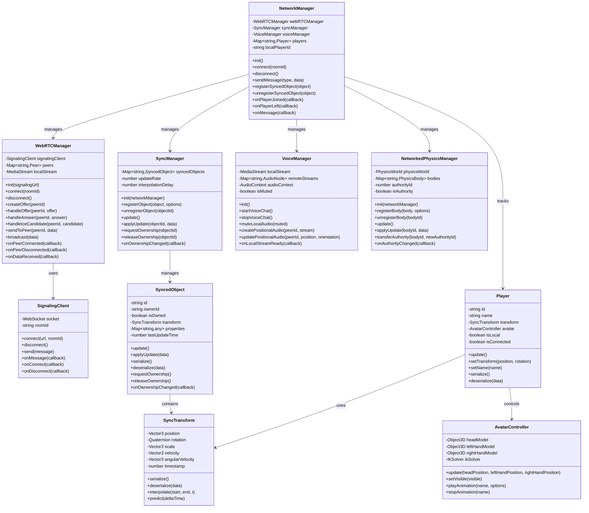

# Multiplayer Architecture Diagram

```mermaid
classDiagram
    %% Core Classes
    class NetworkManager {
        -WebRTCManager webRTCManager
        -SyncManager syncManager
        -VoiceManager voiceManager
        -Map~string,Player~ players
        -string localPlayerId
        +init()
        +connect(roomId)
        +disconnect()
        +sendMessage(type, data)
        +registerSyncedObject(object)
        +unregisterSyncedObject(object)
        +onPlayerJoined(callback)
        +onPlayerLeft(callback)
        +onMessage(callback)
    }
    
    class WebRTCManager {
        -SignalingClient signalingClient
        -Map~string,Peer~ peers
        -MediaStream localStream
        +init(signalingUrl)
        +connect(roomId)
        +disconnect()
        +createOffer(peerId)
        +handleOffer(peerId, offer)
        +handleAnswer(peerId, answer)
        +handleIceCandidate(peerId, candidate)
        +sendToPeer(peerId, data)
        +broadcast(data)
        +onPeerConnected(callback)
        +onPeerDisconnected(callback)
        +onDataReceived(callback)
    }
    
    class SignalingClient {
        -WebSocket socket
        -string roomId
        +connect(url, roomId)
        +disconnect()
        +send(message)
        +onMessage(callback)
        +onConnect(callback)
        +onDisconnect(callback)
    }
    
    class SyncManager {
        -Map~string,SyncedObject~ syncedObjects
        -number updateRate
        -number interpolationDelay
        +init(networkManager)
        +registerObject(object, options)
        +unregisterObject(objectId)
        +update()
        +applyUpdate(objectId, data)
        +requestOwnership(objectId)
        +releaseOwnership(objectId)
        +onOwnershipChanged(callback)
    }
    
    class SyncedObject {
        -string id
        -string ownerId
        -boolean isOwned
        -SyncTransform transform
        -Map~string,any~ properties
        -number lastUpdateTime
        +update()
        +applyUpdate(data)
        +serialize()
        +deserialize(data)
        +requestOwnership()
        +releaseOwnership()
        +onOwnershipChanged(callback)
    }
    
    class SyncTransform {
        -Vector3 position
        -Quaternion rotation
        -Vector3 scale
        -Vector3 velocity
        -Vector3 angularVelocity
        -number timestamp
        +serialize()
        +deserialize(data)
        +interpolate(start, end, t)
        +predict(deltaTime)
    }
    
    class VoiceManager {
        -MediaStream localStream
        -Map~string,AudioNode~ remoteStreams
        -AudioContext audioContext
        -boolean isMuted
        +init()
        +startVoiceChat()
        +stopVoiceChat()
        +muteLocalAudio(muted)
        +createPositionalAudio(peerId, stream)
        +updatePositionalAudio(peerId, position, orientation)
        +onLocalStreamReady(callback)
    }
    
    class Player {
        -string id
        -string name
        -SyncTransform transform
        -AvatarController avatar
        -boolean isLocal
        -boolean isConnected
        +update()
        +setTransform(position, rotation)
        +setName(name)
        +serialize()
        +deserialize(data)
    }
    
    class AvatarController {
        -Object3D headModel
        -Object3D leftHandModel
        -Object3D rightHandModel
        -IKSolver ikSolver
        +update(headPosition, leftHandPosition, rightHandPosition)
        +setVisible(visible)
        +playAnimation(name, options)
        +stopAnimation(name)
    }
    
    class NetworkedPhysicsManager {
        -PhysicsWorld physicsWorld
        -Map~string,PhysicsBody~ bodies
        -number authorityId
        -boolean isAuthority
        +init(networkManager)
        +registerBody(body, options)
        +unregisterBody(bodyId)
        +update()
        +applyUpdate(bodyId, data)
        +transferAuthority(bodyId, newAuthorityId)
        +onAuthorityChanged(callback)
    }
    
    %% Relationships
    NetworkManager --> WebRTCManager : manages
    NetworkManager --> SyncManager : manages
    NetworkManager --> VoiceManager : manages
    NetworkManager --> Player : tracks
    
    WebRTCManager --> SignalingClient : uses
    
    SyncManager --> SyncedObject : manages
    SyncedObject --> SyncTransform : contains
    
    Player --> AvatarController : controls
    Player --> SyncTransform : uses
    
    NetworkManager --> NetworkedPhysicsManager : manages
```
