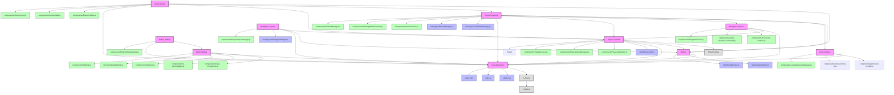

# Package Diagram

```mermaid
flowchart TD
    %% Main Packages
    Core[Core Application]
    Controls[Control Systems]
    Physics[Physics System]
    Models[Model Utilities]
    Navigation[Navigation System]
    UI[User Interface]
    Utils[Utilities]
    Jump[Jump System]
    Multiplayer[Multiplayer System]
    Debug[Debug Utilities]

    %% Core Package
    Core --> index.html
    Core --> main.js
    Core --> styles.css

    %% Control Systems Package
    Controls --> components/ControlManager.js
    Controls --> components/DesktopMobileControls.js
    Controls --> components/ArrowControls.js
    Controls --> managers/DeviceManager.js
    Controls --> managers/LookModeManager.js

    %% Physics System Package
    Physics --> PhysX
    Physics --> components/TogglePhysics.js
    Physics --> components/PhysicsSleepManager.js
    Physics --> components/PhysicsOptimizer.js
    Physics --> utils/PhysicsUtils.js

    %% Model Utilities Package
    Models --> components/lightmap.js
    Models --> components/depthwrite.js
    Models --> components/hideparts.js
    Models --> components/no-tonemapping.js
    Models --> components/make-transparent.js

    %% Navigation System Package
    Navigation --> components/NavigateOnClick.js
    Navigation --> components/simple-navmesh-constraint.js
    Navigation --> components/movement-controls.js

    %% User Interface Package
    UI --> components/LoadingScreenManager.js
    UI --> components/arrow-controls-ui.js
    UI --> components/permission-overlay.js

    %% Utilities Package
    Utils --> utils/StateMachine.js
    Utils --> utils/InteractionUtils.js

    %% Jump System Package
    Jump --> components/JumpControl.js
    Jump --> components/JumpCollider.js
    Jump --> components/PlayerCollider.js

    %% Multiplayer System Package
    Multiplayer --> components/PhysicsSyncManager.js
    Multiplayer --> managers/MultiplayerManager.js

    %% Debug Utilities Package
    Debug --> components/MagnetRangeDebug.js

    %% Dependencies
    Controls --> Core
    Physics --> Core
    Models --> Core
    Navigation --> Core
    UI --> Core
    Utils --> Core
    Jump --> Core
    Multiplayer --> Core
    Debug --> Core

    Navigation --> Physics
    Controls --> Physics
    Controls --> Navigation
    Controls --> UI
    Controls --> Utils
    Physics --> Utils
    Jump --> Physics
    Jump --> Controls
    Jump --> Utils
    Multiplayer --> Physics
    Multiplayer --> Utils
    Debug --> Models

    %% External Dependencies
    AFrame[A-Frame]
    ThreeJS[THREE.js]
    PhysXLib[PhysX Library]

    Core --> AFrame
    AFrame --> ThreeJS
    Physics --> PhysXLib

    %% Styling
    classDef package fill:#f9f,stroke:#333,stroke-width:2px
    classDef module fill:#bbf,stroke:#333,stroke-width:1px
    classDef component fill:#bfb,stroke:#333,stroke-width:1px
    classDef external fill:#ddd,stroke:#333,stroke-width:2px

    class Core,Controls,Physics,Models,Navigation,UI,Utils,Jump,Multiplayer,Debug package
    class index.html,main.js,styles.css,managers/DeviceManager.js,managers/LookModeManager.js,managers/MultiplayerManager.js,utils/PhysicsUtils.js,utils/StateMachine.js,utils/InteractionUtils.js module
    class components/ControlManager.js,components/DesktopMobileControls.js,components/ArrowControls.js,components/TogglePhysics.js,components/PhysicsSleepManager.js,components/PhysicsOptimizer.js,components/PhysicsSyncManager.js,components/lightmap.js,components/depthwrite.js,components/hideparts.js,components/no-tonemapping.js,components/make-transparent.js,components/NavigateOnClick.js,components/simple-navmesh-constraint.js,components/movement-controls.js,components/LoadingScreenManager.js,components/JumpControl.js,components/JumpCollider.js,components/PlayerCollider.js,components/MagnetRangeDebug.js component
    class AFrame,ThreeJS,PhysXLib external
```
